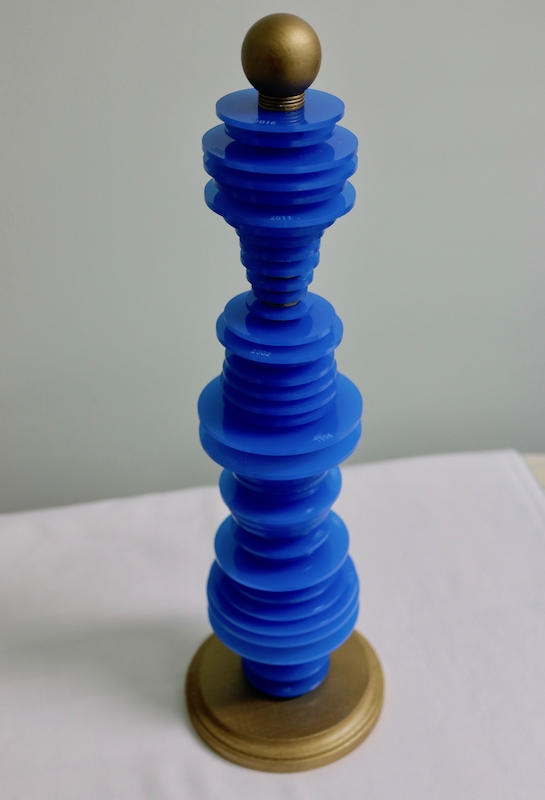

# Data Forms

DataForms allows you to create physical manifestations of data. Data sets are drawn on a 2D plane and downloadable as a single SVG. Modify the downloaded file or send it straight to a laser cutter for processing.

Visit [dataforms.joelongstreet.com](https://dataforms.joelongstreet.com) to use the app.

## Examples

### Customer value over time (C2FO) - 2014 to 2018

### Kansas City Royals (Stolen Bases) - 1969 to 2016

## Available Scripts

### `npm start`
Runs the app in the development mode.

### `npm run deploy`
Build the app for production and pushes to github pages. It correctly bundles React in production mode and optimizes the build for the best performance.
The build is minified and the filenames include the hashes.
